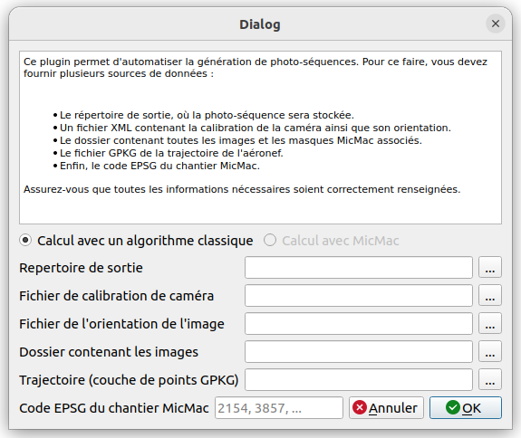

# Générateur de photoséquence
Cet plugin QGIS permet de générer une photoséquence à partir d’une trajectoire d’avion et d’une mise en place
absolue de caméra.

## Prérequis
* Testé avec python 3.10.12 
* Testé avec QGIS 3.34

## Installation
### Installation via archive

1. Téléchargez puis décompressez l'archive.
2. Dans l'archive, vous trouverez un dossier nommé `photosequence`, qui contient un fichier `requirements.txt`. 
   - Ouvrez le terminal **OSGeo4Shell** et placez-vous dans le dossier `photosequence` à l'aide de la commande suivante :
     ```bash
     cd path\vers\dossier\photosequence
     ```
   - Exécutez ensuite la commande suivante pour installer les dépendances requises :
     ```bash
     pip install -r requirements.txt
     ```
     Cette commande permettra d'installer toutes les dépendances nécessaires au bon fonctionnement du plugin.

3. Pour installer le plugin dans QGIS :
   - Ouvrez votre version de QGIS.
   - Allez dans le menu **Extensions** > **Installer / Gérer les extensions**.
   - Sélectionnez l'option **Installer depuis un ZIP**.
   - Glissez le fichier compressé `generateur_photosequence.zip` dans la fenêtre pour installer le plugin.
   - Le plugin pourra être utilisé depuis la barre d'outil QGIS.
	


## Utiliser l'interface


Après l'exécution du plugin, il est nécessaire de fournir toutes les données demandées, comme indiqué dans la section supérieure de l'interface. Pour choisir les fichiers, cliquez sur le bouton '...' situé à droite de chaque champ de saisie.

Les fichiers d'orientation et de calibration doivent impérativement être au format MicMac. Vous trouverez des exemples de ces fichiers aux chemins suivants : Images/Exemple_fichier_orientation.png et Images/Exemple_fichier_calibration.png.

Une fois que tous les fichiers sont renseignés, appuyez sur 'OK' pour démarrer la génération de la photoséquence. Un projet QGIS sera alors créé et les différentes couches seront automatiquement ajoutées.

## Support
Pour toute question, contacter jules.rosier@ensg.eu.

## Auteur
Jules ROsier

